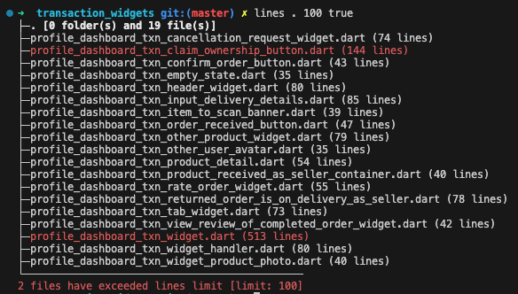

Protobuf Generator
==================

How to install
--------------

1. `go get`
2. `go install`
3. `which lines` should return a path installed on your system
4. run ```lines [path (string)] [max-line (int)] [show total folders/files in a dir (bool)]```
5. ex: `lines . 100 true`

6. Default limit is `1000 lines`